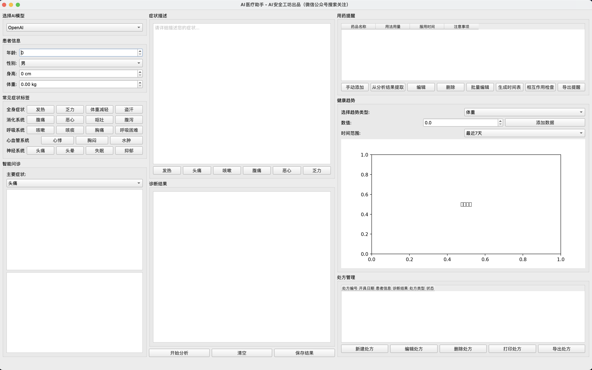

# AI医疗助手 (AI Medical Assistant)

## 项目简介

AI医疗助手是一个基于PyQt的桌面应用程序，旨在帮助用户管理病历、处方和健康数据。该应用集成了AI分析功能，能够根据用户输入的症状提供初步诊断和建议。



## 功能特性

- **病历管理**：
  - 新建病历：输入患者的基本信息（姓名、身份证号、电话、年龄、性别、身高、体重）。
  - 加载病历：从数据库中加载病历记录。
  - 删除病历：删除已存在的病历记录。

- **处方管理**：
  - 新建处方：为患者创建新的处方记录。
  - 编辑处方：修改现有处方信息。
  - 删除处方：删除不再需要的处方记录。
  - 打印处方：将处方信息打印为PDF或Word文档。
  - 导出处方：将处方信息导出为文件。

- **健康趋势图**：
  - 记录体重、血压、血糖等健康数据，并以图表形式展示。
  - 支持选择时间范围（最近7天、30天、90天等）来查看健康趋势。

- **用药提醒**：
  - 添加、编辑和删除用药提醒。
  - 提供药品名称、用法用量、服用时间和注意事项的输入。

- **智能问诊**：
  - 通过AI分析患者的症状和基本信息，提供初步诊断和建议。

## 技术栈

- **前端**: PyQt6
- **后端**: SQLite
- **数据可视化**: Matplotlib
- **文档生成**: ReportLab, python-docx
- **API交互**: requests
- **数据处理**: pandas, numpy

## 安装与运行

1. 克隆项目：

   ```bash
   git clone https://github.com/taielab/ai-medical-assistant.git
   cd ai-medical-assistant
   ```

2. 安装依赖：

   ```bash
   pip install -r requirements.txt
   ```

3. 运行应用：

   ```bash
   python medical_assistant.py
   ```

## 配置

应用程序的配置文件为 `config.yaml`，可以根据需要进行修改。确保在文件中正确设置 API 密钥和基本 URL。

```yaml
openai:
  api_key: YOUR_OPENAI_API_KEY
  base_url: https://yunwu.ai/v1

deepseek:
  api_key: YOUR_DEEPSEEK_API_KEY
  base_url: https://api.deepseek.com/v1
```

## API 文档

### OpenAI API

- **API Key**: 在 `config.yaml` 中配置。
- **Base URL**: `https://yunwu.ai/v1`

### DeepSeek API

- **API Key**: 在 `config.yaml` 中配置。
- **Base URL**: `https://api.deepseek.com/v1`

## 示例用法

1. **新建病历**：
   - 点击“新建病历”按钮，填写患者信息并保存。

2. **加载病历**：
   - 点击“加载病历”按钮，从列表中选择病历记录进行加载。

3. **处方管理**：
   - 在处方管理模块中，点击“新建处方”以创建新的处方记录。

## 常见问题解答 (FAQ)

### Q1: 如何修改配置文件？

A1: 在项目根目录下找到 `config.yaml` 文件，使用文本编辑器打开并修改 API 密钥和基本 URL。

### Q2: 如何添加新的药品信息？

A2: 在处方管理模块中，点击“新建处方”，在药品信息部分添加药品名称、规格等信息。

### Q3: 如何查看健康趋势图？

A3: 在健康趋势模块中，选择时间范围并点击“更新”按钮查看健康数据的趋势图。

## 更新日志

### v1.0.0

- 初始版本发布，包含基本的病历管理、处方管理和健康数据记录功能。

## 贡献

欢迎任何形式的贡献！请提交问题、功能请求或拉取请求。

1. Fork 本仓库
2. 创建您的特性分支 (`git checkout -b feature/AmazingFeature`)
3. 提交您的更改 (`git commit -m 'Add some AmazingFeature'`)
4. 推送到分支 (`git push origin feature/AmazingFeature`)
5. 创建一个新的 Pull Request

## 微信公众号关注

 AI安全工坊：专注 AI 安全技术研究与实践，分享前沿资讯、实战案例、工具资源，打造专业、开放的 AI 安全技术交流工坊。


## 许可证

本项目采用 MIT 许可证，详细信息请查看 [LICENSE](LICENSE) 文件。

## 联系

如有任何问题或建议，请联系 [aiseckit@gmail.com](mailto:aiseckit@gmail.com)。
